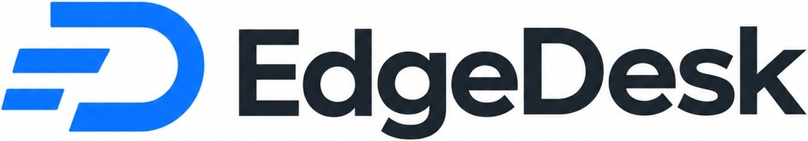

# EdgeDesk

EdgeDesk is a remote desktop app based on [RustDesk](https://github.com/rustdesk/rustdesk). It uses EdgeAlphix servers. The server selects a nearby relay and skips offline nodes; devices on the same local network can connect directly.

## Downloads

[Releases](https://github.com/EdgeAlphix/EdgeDesk/releases) · Android, iOS, macOS, Windows and Linux.

The first release is being built. iOS packages require Apple signing before installation.

## Build

Builds follow stable RustDesk releases, not individual commits. See [build instructions](edgedesk/BUILDING.md).

## License

[GNU AGPL-3.0](LICENCE). RustDesk copyright notices are retained. Releases include the corresponding source code and patches.
