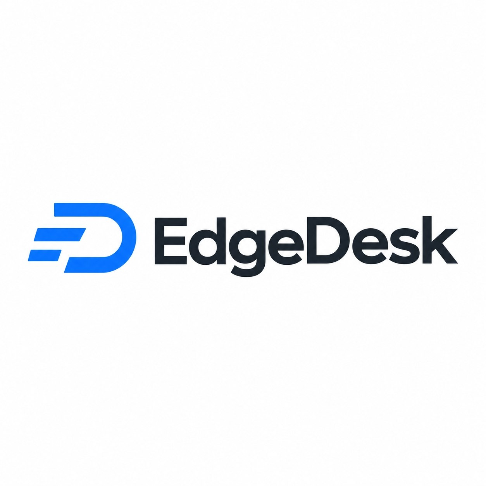

# EdgeDesk

EdgeDesk is a managed remote desktop client based on released versions of RustDesk, licensed under GNU AGPL-3.0. The application identifier is `com.edgealphix.desk` on Android, iOS and macOS.



Software owner: **International Computing Group, LLC**
Operator: **EdgeAlphix LLC**
Anaheim, CA 92802, United States

## Managed network

- Console: https://console.edgedesk.edgealphix.com/
- API: https://api.edgedesk.edgealphix.com/
- ID server: `api.edgedesk.edgealphix.com:21116`
- Relay: selected by the ID server from the nearest healthy managed node; an unavailable node is excluded.

Server configuration is compiled into the Rust core and cannot be changed through settings, external configuration, CLI, filename customization or alternate-server connection IDs. LAN direct connections are supported. A source-code recipient can modify and rebuild the AGPL software.

UDP hole punching, IPv6 P2P and insecure TLS fallback default on. WebSocket defaults off. RustDesk public service destinations and device version-check telemetry are disabled. Connection/authentication traffic goes to the managed infrastructure. The original Android/iOS/macOS branding and unused Firebase configuration are replaced.

## Release automation

`edgedesk-release.yml` checks GitHub's latest **published stable release** every six hours. A commit on upstream does not trigger a build. A release already published by EdgeDesk is skipped. Failed builds can retry the same immutable source tag. Workflow dispatch performs the same stable-release check.

`edgedesk/prepare_release.py` checks out that exact upstream tag, applies the maintained overlay, generates the reusable build workflows from that release, verifies policy and vendors modified `hbb_common`. It creates an immutable `v<upstream>-edgedesk.1` source tag. Structural upstream changes cause preparation to fail rather than silently publishing an unrestricted client.

All requested formats must exist before publication: Android APK, unsigned iOS IPA, macOS `.app.zip` and DMG, Windows EXE, Linux DEB/RPM/openSUSE RPM/Arch `.pkg.tar.zst`/AppImage/Flatpak and a pinned Nix derivation. Source archives, patches, upstream provenance and SHA256 checksums accompany the release.

## Build and signing

The released upstream workflows provide platform toolchains and native dependency builds. `.github/workflows/edgedesk-build.yml`, `edgedesk-bridge.yml` and `edgedesk-topmost.yml` are reusable workflows only. There are no nightly or push build entry points.

Android secrets: `ANDROID_SIGNING_KEY` (base64 keystore), `ANDROID_ALIAS`, `ANDROID_KEY_STORE_PASSWORD`, `ANDROID_KEY_PASSWORD`. Keep the same key for updates.

macOS secrets: `MACOS_P12_BASE64`, `MACOS_P12_PASSWORD`, `MACOS_CODESIGN_IDENTITY`, `MACOS_NOTARIZE_JSON`. Without them, unsigned macOS app archives are still built. The iOS archive requires your own Apple provisioning/signing for distribution; this repository does not claim an unsigned IPA is installable on a standard iPhone.

Windows signing is optional through the inherited `SIGN_BASE_URL` and `SIGN_SECRET_KEY` integration. No signing credential is included in source.

To prepare the overlay locally, start from a clean RustDesk stable tag with submodules initialized, copy this repository's `edgedesk/` directory, install Python Pillow/PyYAML, then run:

```sh
python3 edgedesk/apply.py
python3 edgedesk/finalize.py
python3 edgedesk/workflows.py
python3 edgedesk/verify.py
```

## Open source

Original RustDesk: https://github.com/rustdesk/rustdesk
EdgeDesk corresponding source and patches: https://github.com/EdgeAlphix/EdgeDesk
License: GNU Affero General Public License version 3, preserved in `LICENCE`.

Every release includes the exact modified dependency source, installer source, automation and binary patches. Existing upstream copyright and third-party notices remain. The application About/Open Source Licenses pages identify RustDesk's AGPL license and link to this repository.
